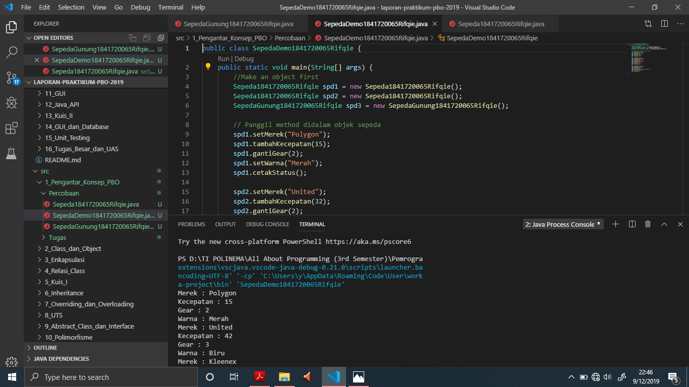
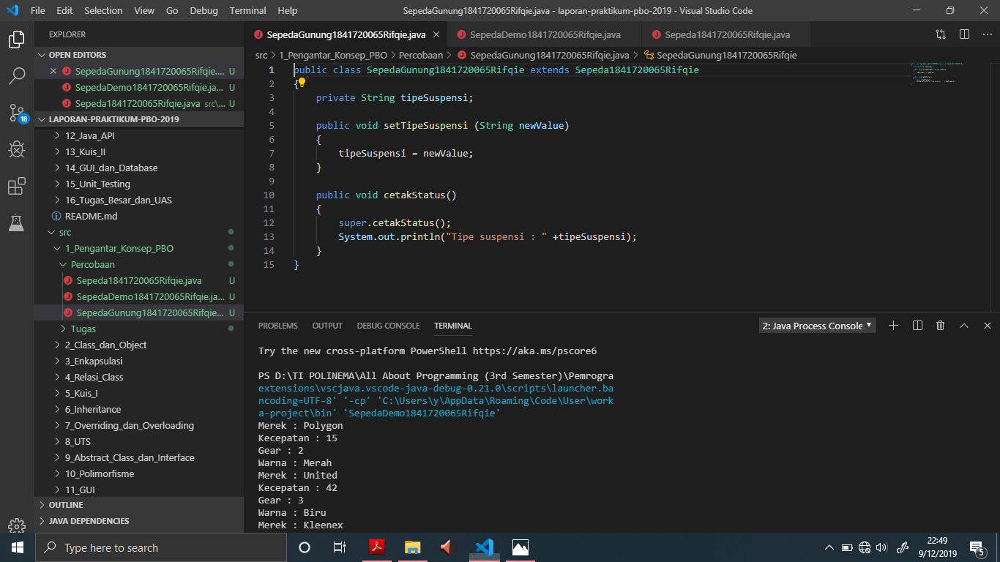
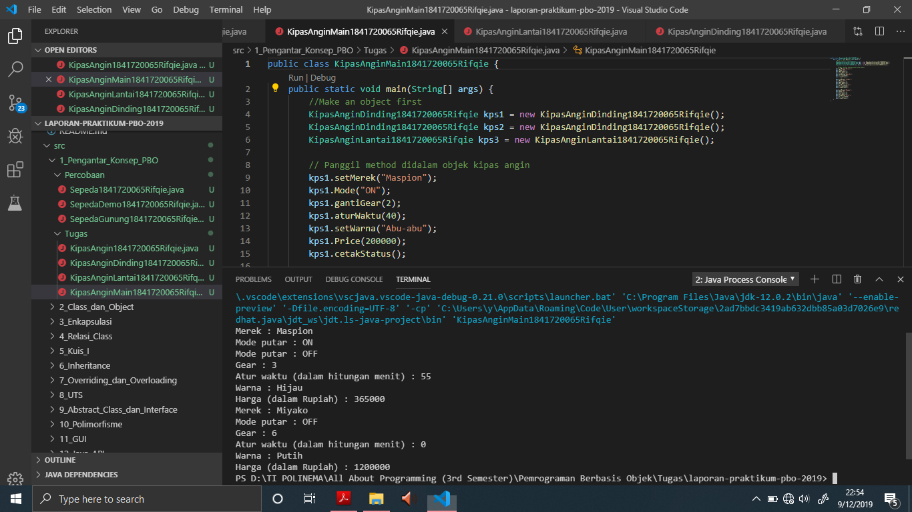
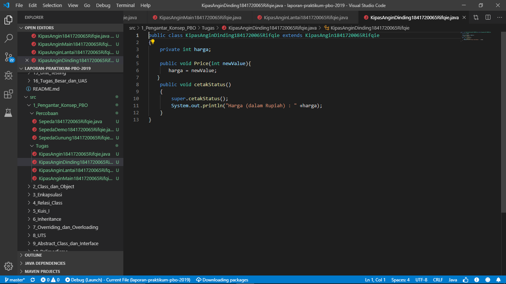

# Laporan Praktikum #1 - Pengantar Konsep PBO

## Kompetensi

1.Perbedaan paradigma berorientasi objek dengan paradigma struktural

2.Konsep dasar PBO

## Ringkasan Materi

Setiap kejadian di suatu waktu, ada beberapa komponen yang membentuk suatu objek yang dimana komponen tersebut mampu bekerja secara langsung tanpa perlu melihat detailnya.

## Percobaan

### Percobaan 1
Berikut adalah contoh hasil Screenshot dari Sepeda.java

Ini adalah kode Sepeda.java: 
[Link ke kode program](../../src/1_Pengantar_Konsep_PBO/Percobaan/Sepeda1841720065Rifqie.java)

Dan ini adalah kode main SepedaDemo.java :
[Link ke kode main program](../../src/1_Pengantar_Konsep_PBO/Percobaan/SepedaDemo1841720065Rifqie.java)

### Percobaan 2

Ini adalah hasil turunan dari Sepeda.java

Berikut hasil kodenya : [link ke kode program SepedaGunung.java](../../src/1_Pengantar_Konsep_PBO/Percobaan/SepedaGunung1841720065Rifqie.java)

## Pertanyaan
1.Object : 	Rangkaian program yang terdiri dari state dan behaviour. State yaitu ciri-ciri pada suatu objek, sedangkan Behaviour adalah perilaku yang akan dilakukan oleh objek tersebut.
Class :	Blueprint atau prototype pada objek. Prototype pada laptop bisa berbagai macam merek namun teknik dasar pada pembuatan laptop, itu sama.
Enkapsulasi : Menyembunyikan detail pada objek. Ketika kita menggunakan mesin kopi, kita hanya perlu menekan tombol pada mesin kopi saja, tanpa perlu melihat bagaimana cara kopi tersebut dibuat oleh mesin itu.
Inheritance : Memperluas fungsionalitas program tanpa mengubah banyak program
Polimorfisme : Mewariskan suatu program yang dimana bisa menjadi bentuk lain dan memiliki jenis yang beragam.

2.Object : Rangkaian program atau istilahnya seperti bahan-bahan (ingredients) dalam membentuk suatu prototype (blueprint)
Class : Prototype (blueprint) yang akan dibuat dan dipublikasikan yang statusnya masih perlu pengembangan yang lebih baik (masih belum menjadi final product)

 
3.

-Meringkas hasil pemrograman menjadi lebih sederhana.

-Mudah digunakan dan tidak perlu waktu yang lama.

-Tidak perlu melihat bagaimana konsep pemrograman tersenut secara struktural.

4.Merek, Kecepatan, Gear, Rem, Warna, Ban, Penyangga, Setir

5.

6.
Karena ada kata “extends” yang fungsinya sebagai pewaris dan bisa diturunkan ke dalam beberapa jenis sepeda.

## Tugas

Ini adalah contoh kode KipasAngin.java

Ini adalah contoh kode main dari KipasAnginMain.java

Ini adalah contoh kode KipasAnginLantai.java 

Dan Ini adalah contoh kode KipasAnginDinding.java

link menuju kode program : [KipasAngin.java](../../src/1_Pengantar_Konsep_PBO/Tugas/KipasAngin1841720065Rifqie.java)

link menuju kode program : [KipasAnginMain.java](../../src/1_Pengantar_Konsep_PBO/Tugas/KipasAnginMain1841720065Rifqie.java)

link menuju kode program : [KipasAnginLantai.java](../../src/1_Pengantar_Konsep_PBO/Tugas/KipasAnginLantai1841720065Rifqie.java)

link menuju kode program : [KipasAnginDinding.java](../../src/1_Pengantar_Konsep_PBO/Tugas/KipasAnginDinding1841720065Rifqie.java)

## Kesimpulan

OOP atau Object Orieted Program dapat meringankan komponen pada suatu program tanpa harus melihat bahkan mengetik teralu lama pada struktur pemrograman tersebut.

## Pernyataan Diri

Saya menyatakan isi tugas, kode program, dan laporan praktikum ini dibuat oleh saya sendiri. Saya tidak melakukan plagiasi, kecurangan, menyalin/menggandakan milik orang lain.

Jika saya melakukan plagiasi, kecurangan, atau melanggar hak kekayaan intelektual, saya siap untuk mendapat sanksi atau hukuman sesuai peraturan perundang-undangan yang berlaku.

Ttd,

***(Rifqie Muhammad)***
