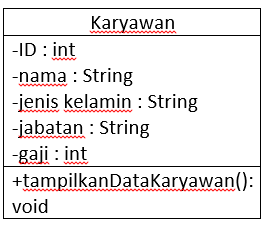

# Laporan Praktikum #2 - Class dan Object

## Kompetensi

Memahami deskripsi dari class dan object serta bagaimana cara mengimplementasikannya.

## Ringkasan Materi

Class dan Object merupakan gabungan dari suatu program. Ibaratnya class itu seperti judul dan Object itu bisa dijadikan berbagai macam seperti isi, inti dari pemrograman, dan juga proses bagaimana kode pemrograman tersebut disusun.

## Percobaan

### Percobaan 1

1.

2.
Karyawan.
3.
ID, Nama, Jenis Kelamin, Jabatan, dan Gaji.
4.
tampilkanDataKaryawan.

### Percobaan 2

3.
\Pemrograman Berbasis Objek\Tugas\laporan-praktikum-pbo-master\src\2_Class_dan_Object/Mahasiswa.java)

5.
ink kode program : [ini contoh link ke kode program](D:\TI POLINEMA\All About Programming (3rd Semester)\Pemrograman Berbasis Objek\Tugas\laporan-praktikum-pbo-master\src\1_Pengantar_Konsep_PBO/SepedaGunung.java)

## Pertanyaan

(1.
Object : 	Rangkaian program yang terdiri dari state dan behaviour. State yaitu ciri-ciri pada suatu objek, sedangkan Behaviour adalah perilaku yang akan dilakukan oleh objek tersebut.
Class :	Blueprint atau prototype pada objek. Prototype pada laptop bisa berbagai macam merek namun teknik dasar pada pembuatan laptop, itu sama.
Enkapsulasi : Menyembunyikan detail pada objek. Ketika kita menggunakan mesin kopi, kita hanya perlu menekan tombol pada mesin kopi saja, tanpa perlu melihat bagaimana cara kopi tersebut dibuat oleh mesin itu.
Inheritance : Memperluas fungsionalitas program tanpa mengubah banyak program
Polimorfisme : Mewariskan suatu program yang dimana bisa menjadi bentuk lain dan memiliki jenis yang beragam.

(2.
Object : Rangkaian program atau istilahnya seperti bahan-bahan (ingredients) dalam membentuk suatu prototype (blueprint)
Class : Prototype (blueprint) yang akan dibuat dan dipublikasikan yang statusnya masih perlu pengembangan yang lebih baik (masih belum menjadi final product)

 
(3.
-Meringkas hasil pemrograman menjadi lebih sederhana.
-Mudah digunakan dan tidak perlu waktu yang lama.
-Tidak perlu melihat bagaimana konsep pemrograman tersenut secara struktural.

(4.
Merek, Kecepatan, Gear, Rem, Warna, Ban, Penyangga, Setir

(5.

(6.
Karena ada kata “extends” yang fungsinya sebagai pewaris dan bisa diturunkan ke dalam beberapa jenis sepeda.

## Tugas

(silakan kerjakan tugas di sini beserta `screenshot` hasil kompilasi program. Jika ada rujukan ke file program, bisa dibuat linknya di sini.)

`contoh screenshot yang benar, menampilkan 3 komponen, yaitu struktur project, kode program, dan hasil kompilasi`

(img/ScreenShot-Kipas2.PNG)
(img/ScreenShot-Kipas3.PNG)
(img/ScreenShot-Kipas4.PNG)

Contoh link kode program : [ini contoh link ke kode program](D:\TI POLINEMA\All About Programming (3rd Semester)\Pemrograman Berbasis Objek\Tugas\laporan-praktikum-pbo-master\src\1_Pengantar_Konsep_PBO/KipasAngin.java)
(D:\TI POLINEMA\All About Programming (3rd Semester)\Pemrograman Berbasis Objek\Tugas\laporan-praktikum-pbo-master\src\1_Pengantar_Konsep_PBO/KipasAnginMain.java)
(D:\TI POLINEMA\All About Programming (3rd Semester)\Pemrograman Berbasis Objek\Tugas\laporan-praktikum-pbo-master\src\1_Pengantar_Konsep_PBO/KipasAnginDinding.java)
(D:\TI POLINEMA\All About Programming (3rd Semester)\Pemrograman Berbasis Objek\Tugas\laporan-praktikum-pbo-master\src\1_Pengantar_Konsep_PBO/KipasAnginLantai.java)
## Kesimpulan

(OOP atau Object Orieted Program dapat meringankan komponen pada suatu program tanpa harus melihat bahkan mengetik teralu lama pada struktur pemrograman tersebut.)

## Pernyataan Diri

Saya menyatakan isi tugas, kode program, dan laporan praktikum ini dibuat oleh saya sendiri. Saya tidak melakukan plagiasi, kecurangan, menyalin/menggandakan milik orang lain.

Jika saya melakukan plagiasi, kecurangan, atau melanggar hak kekayaan intelektual, saya siap untuk mendapat sanksi atau hukuman sesuai peraturan perundang-undangan yang berlaku.

Ttd,

***(Rifqie Muhammad)***
