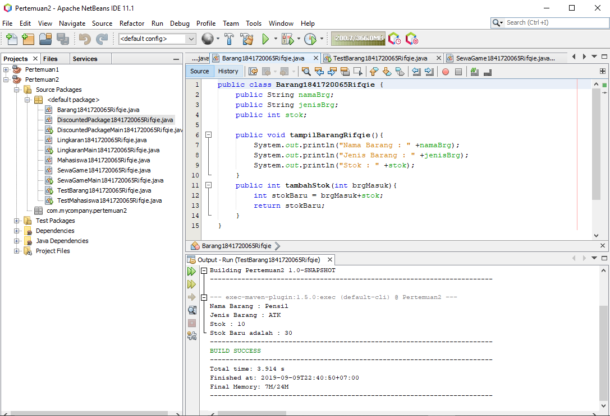

# Laporan Praktikum #2 - Class dan Object

## Kompetensi

Memahami deskripsi dari class dan object serta bagaimana cara mengimplementasikannya.

## Ringkasan Materi

Class dan Object merupakan gabungan dari suatu program. Ibaratnya class itu seperti judul dan Object itu bisa dijadikan berbagai macam seperti isi, inti dari pemrograman, dan juga proses bagaimana kode pemrograman tersebut disusun.

## Percobaan

### Percobaan 1

1.Diagram Class Karyawan, Screenshot:

2.Sebutkan Class apa saja yang bisa dibuat dari studi kasus 1
Jawaban : Karyawan.

3.Sebutkan atribut beserta tipe datanya yang dapat diidentifikasi dari masing-masing class dari studi kasus 1!
Jawaban : ID, Nama, Jenis Kelamin, Jabatan, dan Gaji.

4.Sebutkan method-method yang sudah anda buat dari masing-masing class pada studi kasus 1!

Jawaban : tampilkanDataKaryawan.

### Percobaan 2

3.Ini adalah kode Mahasiswa.java
[link ke kode program](../../src/2_Class_dan_Object/Percobaan2/Mahasiswa1841720065Rifqie.java)

5.Dan ini adalah kode MahasiswaMain.java [link ke kode main program](../../src/2_Class_dan_Object/Percobaan2/TestMahasiswa1841720065Rifqie.java)

6.Screenshot untuk hasil test nya:

7.Jelaskan pada bagian mana proses pendeklarasian atribut pada program diatas!

Jawaban : Pendeklarasian atributnya akan dilakukan di void tampilBiodata.

8.Pada bagian mana proses pendeklarasian method pada program diatas?

Jawaban : Pendeklarasian methodnya akan dilakukan di main file pada java.

9.Berapa banyak objek yang di instansiasi pada program diatas!
Jawaban : Ada 4

10.Apakah yang sebenarnya dilakukan pada sintaks program “mhs1.nim=101”?

Jawaban : Menginput bahwa NIM (Nomor Induk Mahasiswa) pada mahasiswa tersebut adalah 101.

11.Apakah yang sebenarnya dilakukan pada sintaks program “mhs1.tampilBiodata()”?

Jawaban : Menampilkan semua data yang telah dimasukkan ke dalam suatu atribut untuk dijalankan.

12.Screenshot untuk Mahasiswa.java setelah ditambahkan 2 objek :

## Percobaan 3

3.Ini adalah link kode Barang.java
[link ke kode program](../../src/2_Class_dan_Object/Percobaan3/Barang1841720065Rifqie.java)

5.Ini adalah link kode BarangMain.java
[link ke kode main program](../../src/2_Class_dan_Object/Percobaan3/TestBarang1841720065Rifqie.java)

6.Screenshot untuk hasil test Barang :

7.Apakah fungsi argumen dalam suatu method?

Jawaban : Menambahkan suatu method yang didalamnya terkandung atribut.

8.Ambil kesimpulan tentang kegunaan dari kata kunci return , dan kapan suatu method harus memiliki return!

Jawaban : Return yaitu mengembalikan suatu proses yang dimana ketika kita menjalankan suatu program, method yang ditambahkan ke dalam suatu atribut akan dikembalikan lagi dengan hasil yang baru atau tetap. Method harus memiliki return ketika ada perubahan atau perulangan.

## Tugas

1.Screenshot class diagram sewa game :

2.Screenshot :

[link ke kode program SewaGame.java](../../src/2_Class_dan_Object/Tugas1/SewaGame1841720065Rifqie.java)

[link ke kode main program SewaGameMain.java](../../src/2_Class_dan_Object/Tugas1/SewaGameMain1841720065Rifqie.java)

3.Screenshot :

[link ke kode program Lingkaran.java](../../src/2_Class_dan_Object/Tugas2/Lingkaran1841720065Rifqie.java)

[link ke kode main program LingkaranMain.java](../../src/2_Class_dan_Object/Tugas2/LingkaranMain1841720065Rifqie.java)

4.Screenshot :

[link ke kode program BarangDiskon.java](../../src/2_Class_dan_Object/Tugas3/DiscountedPackage1841720065Rifqie.java)

[link ke kode main program BarangDiskonMain.java](../../src/2_Class_dan_Object/Tugas3/DiscountedPackageMain1841720065Rifqie.java)

## Kesimpulan

Class dan Object memiliki atribut dan method sesuai dengan apa yang diinginkan oleh programmernya dan memiliki aturan tertentu.

## Pernyataan Diri

Saya menyatakan isi tugas, kode program, dan laporan praktikum ini dibuat oleh saya sendiri. Saya tidak melakukan plagiasi, kecurangan, menyalin/menggandakan milik orang lain.

Jika saya melakukan plagiasi, kecurangan, atau melanggar hak kekayaan intelektual, saya siap untuk mendapat sanksi atau hukuman sesuai peraturan perundang-undangan yang berlaku.

Ttd,

***(Rifqie Muhammad)***
