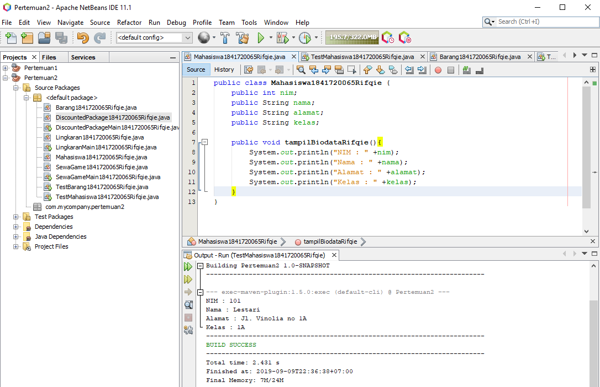
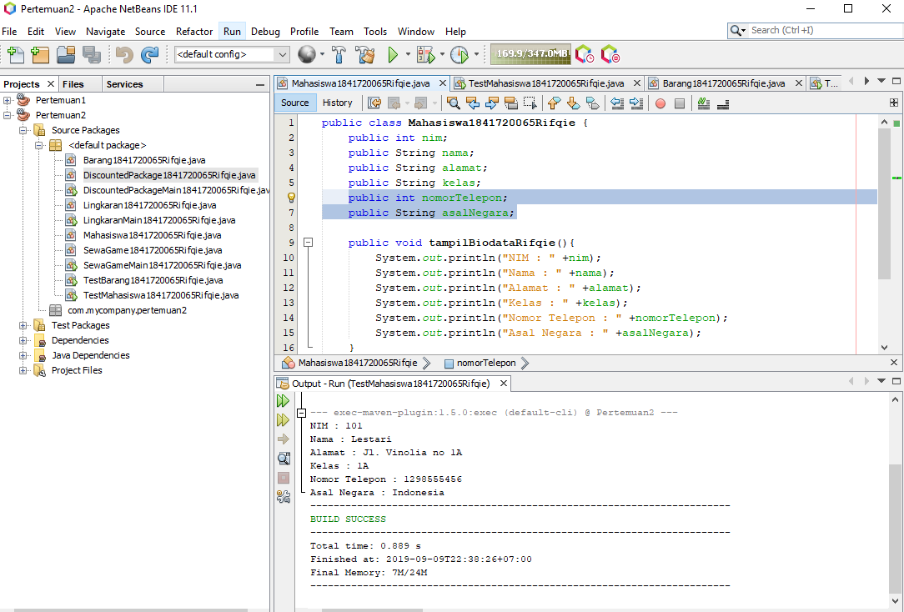

# Laporan Praktikum #2 - Class dan Object

## Kompetensi

Memahami deskripsi dari class dan object serta bagaimana cara mengimplementasikannya.

## Ringkasan Materi

Class dan Object merupakan gabungan dari suatu program. Ibaratnya class itu seperti judul dan Object itu bisa dijadikan berbagai macam seperti isi, inti dari pemrograman, dan juga proses bagaimana kode pemrograman tersebut disusun.

## Percobaan

### Percobaan 1

1.

2.
Karyawan.

3.
ID, Nama, Jenis Kelamin, Jabatan, dan Gaji.

4.
tampilkanDataKaryawan.

### Percobaan 2

3.

5.

6.

7.
Pendeklarasian atributnya akan dilakukan di void tampilBiodata.

8.
Pendeklarasian methodnya akan dilakukan di main file pada java.

9.
Ada 4

10.
Menginput bahwa NIM (Nomor Induk Mahasiswa) pada mahasiswa tersebut adalah 101.

11.
Menampilkan semua data yang telah dimasukkan ke dalam suatu atribut untuk dijalankan.

12.

## Percobaan 3
3.

5.

6.

`contoh screenshot yang benar, menampilkan 3 komponen, yaitu struktur project, kode program, dan hasil kompilasi`

(img/ScreenShot-Kipas2.PNG)
(img/ScreenShot-Kipas3.PNG)
(img/ScreenShot-Kipas4.PNG)

Contoh link kode program : [ini contoh link ke kode program](D:\TI POLINEMA\All About Programming (3rd Semester)\Pemrograman Berbasis Objek\Tugas\laporan-praktikum-pbo-master\src\1_Pengantar_Konsep_PBO/KipasAngin.java)
(D:\TI POLINEMA\All About Programming (3rd Semester)\Pemrograman Berbasis Objek\Tugas\laporan-praktikum-pbo-master\src\1_Pengantar_Konsep_PBO/KipasAnginMain.java)
(D:\TI POLINEMA\All About Programming (3rd Semester)\Pemrograman Berbasis Objek\Tugas\laporan-praktikum-pbo-master\src\1_Pengantar_Konsep_PBO/KipasAnginDinding.java)
(D:\TI POLINEMA\All About Programming (3rd Semester)\Pemrograman Berbasis Objek\Tugas\laporan-praktikum-pbo-master\src\1_Pengantar_Konsep_PBO/KipasAnginLantai.java)
## Kesimpulan

(OOP atau Object Orieted Program dapat meringankan komponen pada suatu program tanpa harus melihat bahkan mengetik teralu lama pada struktur pemrograman tersebut.)

## Pernyataan Diri

Saya menyatakan isi tugas, kode program, dan laporan praktikum ini dibuat oleh saya sendiri. Saya tidak melakukan plagiasi, kecurangan, menyalin/menggandakan milik orang lain.

Jika saya melakukan plagiasi, kecurangan, atau melanggar hak kekayaan intelektual, saya siap untuk mendapat sanksi atau hukuman sesuai peraturan perundang-undangan yang berlaku.

Ttd,

***(Rifqie Muhammad)***
